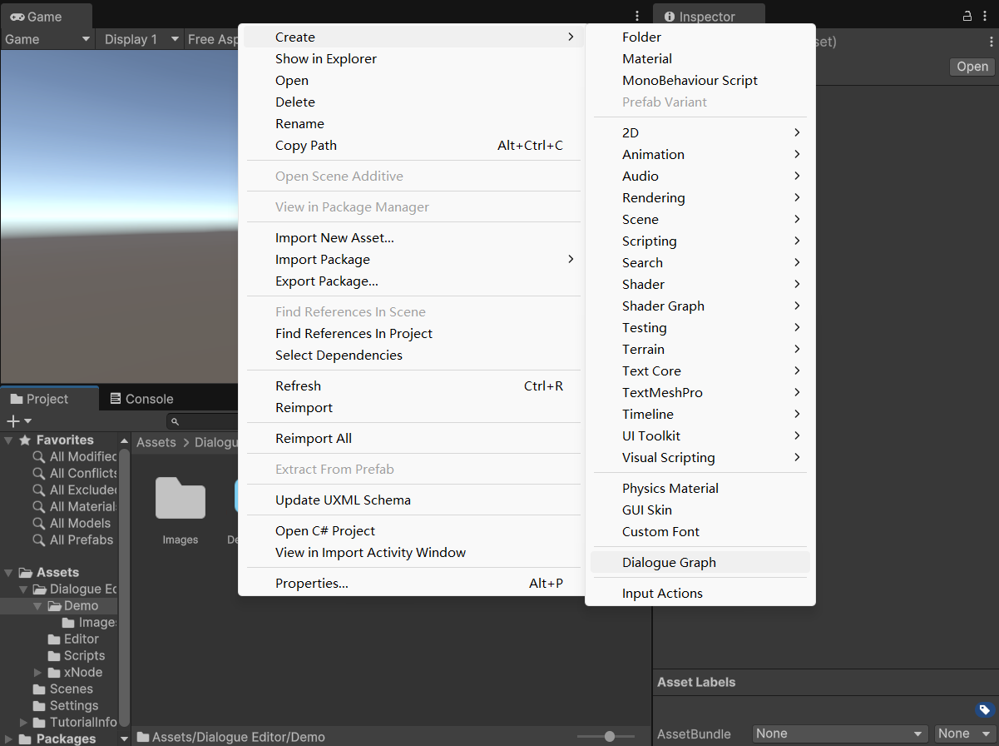
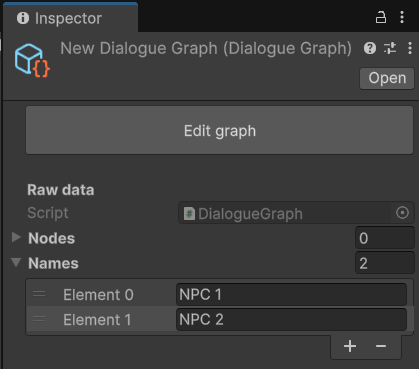
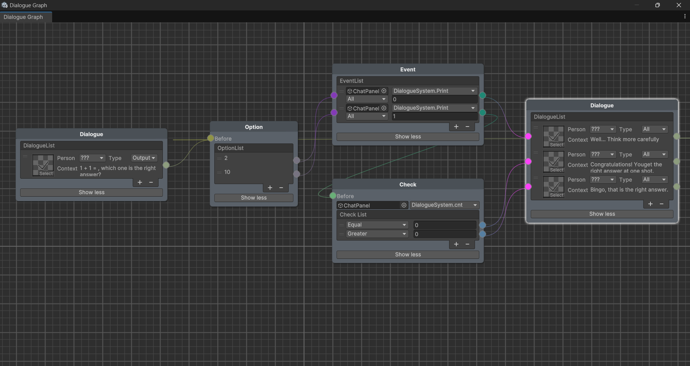
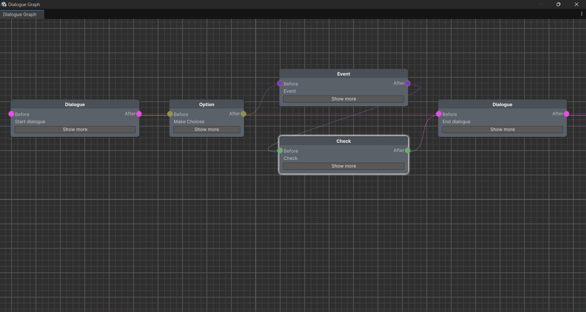

## 可视化对话编辑器

[English Version](README.md)

&emsp;&emsp;这是一个基于xNode的简单可视化对话编辑器。如果您之前使用过 Visual Scripting 或 Amplify Shader Editor 之类的东西，您可能对相关操作较为熟悉。

### 创建

&emsp;&emsp;右键单击并选择 Create/Dialogue Graph，你将获得一个名为 New Dialogue Graph 的文件。在双击文件进行编辑之前，可以先在检查器中的文件列表中添加名称，以便稍后可以在对话节点中下拉选择名称。

<center class="half">


</center>

### 编辑

&emsp;&emsp;对话编辑器中有四种不同类型的节点。它们是对话节点（最常用的节点）、选项节点（在游戏中做出选择也很常见）、事件节点（调用一些公共函数）、检查节点（检测公共变量，不同的值将导向不同的方向）。对话节点和事件节点中的项同时具有输入端口和输出端口，这使得节点变得更加灵活。总体而言信息的流向很清晰，只有一件事需要注意，如果一个项目的输出端口没有连接任何东西，那么它就是一个终点。顺便说下，如果节点太长，你也可以按“Show less”按钮，这将保存连接信息并显示所有节点。

<center class="half">


</center>

### 使用

&emsp;&emsp;您需要将你制作的图表加载为可脚本化对象，然后实例化才能使用。一般情况下，您只需要使用chatInfo、optionInfo和Next()。通过Next()，你可以获取当前步骤的类型和相关信息。然后你可以通过dialogueInfo或optionInfo获取相应的信息。

```C#
// Importing namespace
using DialogueEditor;

// Variables and functions
public enum DataType { End, Dialogue, Option }
public struct DialogueInfo { public Sprite sprite; public string name, context; }
public DialogueInfo dialogueInfo; 
public List<string> optionInfo;
public DataType Next(int num = -1) // -1: continue dialogue, 
                                   //  0 ~ inf: option's index that choiced

// Useage
public ScriptableObject graph; // Load your graph file
DialogueGraph dialogueGraph = (DialogueGraph)Instantiate(graph);
switch (chatGraph.Next(num))
{
    case DialogueGraph.DataType.Dialogue:
        YourSprite = chatGraph.dialogueInfo.sprite;
        YourText = chatGraph.dialogueInfo.name + ":\n" + chatGraph.dialogueInfo.context;
        break;
    case DialogueGraph.DataType.Option:
        for (int i = 0; i < chatGraph.optionInfo.Count; i++) 
            YourOptions = chatGraph.optionInfo[i];
        break;
    case DialogueGraph.DataType.End:
        Do Something...
        break;
}
```
